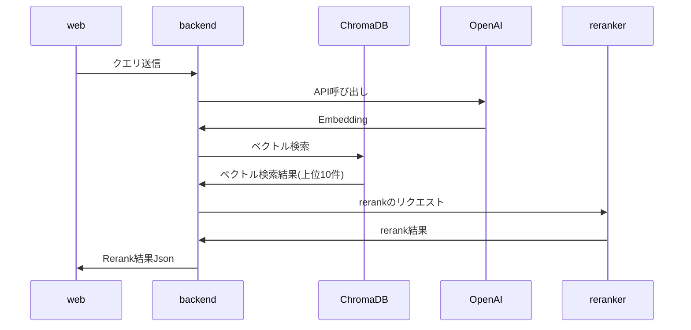

# RAGとrerankでいい感じに検索をする
架空の人物に対してRAGとRerankを用いて検索を行うwebアプリケーションのデモです
架空の人物のデータはChatGPTを用いて生成しています。



## 動かし方
1. このリポジトリをクローンする
```
git clone https://github.com/you22fy/rag_and_rerank_app.git
```

2. OpenAIのAPIキーを設定
`backend/.env.sample`を元に`.env`を作成し、`OPENAI_API_KEY`にOpenAIのAPIキーを設定してください

`OPENAI_API_VERSION`の値は`.env.sample`のままで動作します。必要に応じて適宜変更を行なってください。

3. バックエンドのサーバーを起動する
バックエンドにはpythonのFastAPIで開発をしています。
また、パッケージ管理のために`uv`を使用しています。
```
cd backend
uv sync
uv run uvicorn main:app --reload
```

起動後[swagger](http://localhost:8000/docs)でAPIの仕様を確認できます。

4. フロントエンドを立ち上げる
フロントエンドにはNextJSを使用しています。

```
cd web
npm install
npm run dev
```

起動後、[http://localhost:3000](http://localhost:3000)でアプリケーションにアクセスできます。

## 使用技術
RAGにはLangchainとOpenAIのembeddingモデルを利用し、ChromaDBを用いたベクトルDBを作成しています。

rerankerには[cl-nagoya/ruri-reranker-small](https://huggingface.co/cl-nagoya/ruri-reranker-small)を利用しています。
